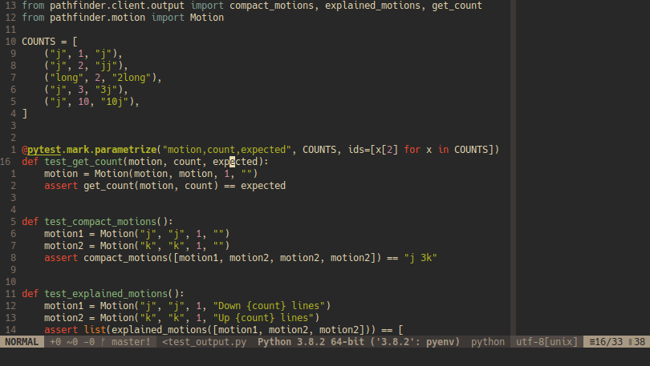

# pathfinder.vim

[](https://codeclimate.com/github/AlphaMycelium/pathfinder.vim/maintainability)
[](https://codeclimate.com/github/AlphaMycelium/pathfinder.vim/test_coverage)

A Vim plugin to give suggestions to improve your movements.
It's a bit like [Clippy][office-assistant].



[office-assistant]: https://en.wikipedia.org/wiki/Office_Assistant


## Features

- Automatic suggestions for cursor movements
- Help summaries to aid in understanding
- Asynchronous - pathfinding runs in a separate process


## Installation

Use your favorite plugin manager. I recommend
[vim-plug](https://github.com/junegunn/vim-plug).

```vim
if has('python3') && has('timers')
  Plug 'AlphaMycelium/pathfinder.vim'
else
  echoerr 'pathfinder.vim is not supported on this Vim installation'
endif
```

You may also need to run `git submodule update --init` from inside the plugin
directory. Most popular plugin managers will do that automatically.


## Usage

1. Move the cursor in normal, visual or visual-line mode.
2. That's it.

Suggestions pop up above the cursor if you have:

- Vim 8.2 or above, with `+popupwin`
- Neovim 0.4 or above

Otherwise, they will appear as a plain `echo` at the bottom of the screen.

### Explanations

If you don't understand how a suggestion works, you should use the
`:PathfinderExplain` command, which will show a short description of each
motion used.

If you find yourself using this a lot, make a mapping for it!

```vim
noremap <leader>pe :PathfinderExplain<CR>
```

### Manual Commands

If you set [`g:pf_autorun_delay`](#gpf_autorun_delay) to a negative value,
you get two commands instead:

- `:PathfinderBegin`: Set the start position. This still happens automatically
  when switching windows/tabs, or loading a new file.
- `:PathfinderRun`: Set the target position and get a suggestion.


## Related Plugins

- [vim-be-good](https://github.com/ThePrimeagen/vim-be-good) - Various training games to practice certain actions
- [vim-hardtime](https://github.com/takac/vim-hardtime) - Prevent yourself from repeating keys like `h`,`j`,`k`,`l`


## Configuration

*pathfinder.vim works out-of-the box with the default configuration. You don't
need to read this section if you don't want to.*

### General settings

#### `g:pf_popup_time`
Milliseconds to display the popup for. *Default: 3000*

#### `g:pf_autorun_delay`
When this number of seconds have elapsed with no motions being made, the
pathfinder will run. It also runs for other events such as changing modes.
A negative value will disable automatic suggestions. *Default: 2*

#### `g:pf_explore_scale`
Multiplier which determines the range of lines to be explored around the start
and target positions. This is calculated as (lines between start and target
&times; multiplier) and added to both sides. *Default: 0.5*

This limitation improves performance by disallowing movements outside the area
of interest. It also prevents suggestions which rely on knowing about the exact
text hundreds of lines away. Settings below 1 cause movements within a line to
only use motions inside that line.

If you have a powerful computer, you can increase this option to a high value
to allow exploring more of the file. You can also disable it completely by
setting a negative value.

#### `g:pf_max_explore`
Cap the number of surrounding lines explored (see above) to a maximum value.
As usual, this can be disabled by making it negative. *Default: 10*

### Motions

A global variable is used to set the available motions:

```vim
let g:pf_motions = [
  \ {'motion': 'h', 'weight': 1, 'description': 'Left {count} columns'},
  \ {'motion': 'l', 'weight': 1, 'description': 'Right {count} columns'},
  \ {'motion': 'j', 'weight': 1, 'description': 'Down {count} lines'},
  \ {'motion': 'k', 'weight': 1, 'description': 'Up {count} lines'},
  \ ...
  \ ]
```

This contains all the supported motions by default. If you do decide to change
it, you will need to copy the entire list from [defaults.vim](plugin/defaults.vim).
There is no way to edit a single motion without doing that.

The higher a motion's `weight`, the less the pathfinding algorithm wants to use
that motion. The path with the lowest total weight wins. The default settings
use the number of characters in the motion as its weight (excluding modifier
keys).

Repeating a motion will not use its predefined weight. Instead, the cost is
calculated based on the effect adding another repetition will have on the
count. This is easier to explain with examples:

| Motion | Cost of adding the repetition |
| --- | --- |
| `j` | (uses configured weight) |
| `j` -> `2j` | 1, since the `2` has been added |
| `2j` -> `3j` | 0, because `3j` is no longer than `2j` |
| `9j` -> `10j` | 1, since `10j` is a character longer than `9j` |
| `1j` -> `100j` | 2, since `100j` is 2 characters longer than `1j` |
