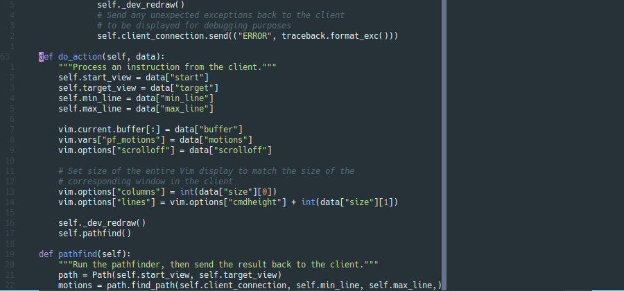

# pathfinder.vim

[](https://codeclimate.com/github/AlphaMycelium/pathfinder.vim/maintainability)

A Vim plugin to give suggestions to improve your movements, by using Dijkstra's
pathfinding algorithm on cursor motions. It's a bit like [Clippy][office-assistant].



Every time you make a movement, a suggested optimal route appears - and if
you're using Vim 8.2 or above (`+popupwin`), you also get a short description
of what each motion does. To allow you to keep typing while it works, paths are
generated in a separate process, which runs Vim with a [barebones vimrc](serverrc.vim).

There is also a possibility of extending the script in the future to work with
other types of edits, such as operators, macros, marks and so on.

[office-assistant]: https://en.wikipedia.org/wiki/Office_Assistant

## Installation

Use your favorite plugin manager. I recommend
[vim-plug](https://github.com/junegunn/vim-plug).

```vim
Plug 'AlphaMycelium/pathfinder.vim'
```

### Requirements

- `+python3`
- `+timers`
- `+popupwin` if you want to see help summaries next to the suggested motions

## Usage

1. Move the cursor in normal, visual or visual-line mode.
2. That's it.

Note that long-distance movements can take a while to calculate, especially on
low-end machines. If another movement is made, the pathfinding will be
cancelled to start processing the new path instead.

If your Vim has `+popupwin` (available since 8.2), you will see a popup at the
bottom of the screen containing the suggestion for the last movement you made,
along with a short description of what each motion does.

If not, the suggestion will be `echo`ed, in a single line without descriptions.

### Manual Commands

If you set `g:pf_autorun_delay` (see below) to any negative value, autorun will
be disabled and instead you get two commands:

- `:PathfinderBegin`: Set the start position. This also happens automatically
  when switching windows/tabs, or loading a new file.
- `:PathfinderRun`: Set the target position and run the pathfinder.

## Configuration

*pathfinder.vim works out-of-the box with the default configuration. You don't
need to read this section if you don't want to.*

### General settings

#### `g:pf_autorun_delay`
Time in seconds where no keypresses occur before starting pathfinding. Note
that it also starts on other events such as entering insert mode. Set to a
negative value to use manual commands. *Default: 2*

#### `g:pf_explore_scale`
Multiplier which determines how many lines the plugin is allowed to explore
above and below the area between the start and target positions. (The result
is rounded down.) *Default: 0.5*

This improves performance significantly by preventing the pathfinding algorithm
from searching in the wrong direction, but some shorter paths may be missed.
These are mainly suggestions which would not be easy to notice without help
from a machine, however, so are not as important for training purposes.

Settings below 1 also mean that movements within a line will only use motions
inside that line.

If you have a powerful computer, you can disable this by setting it to a
negative value, or increase it to a high value allow exploring more of the file.

#### `g:pf_max_explore`
Cap the number of surrounding lines explored (see above) to a maximum value.
As usual, this can be disabled by making it negative. *Default: 10*

#### `g:pf_server_communication_file`
Internal variable set automatically when launching the server Vim.
**Do not set this manually, it will break everything.**

### Motions

The plugin uses a global variable to set the available motions:

```vim
let g:pf_motions = [
  \ {'motion': 'h', 'weight': 1, 'description': 'Left {count} columns'},
  \ {'motion': 'l', 'weight': 1, 'description': 'Right {count} columns'},
  \ {'motion': 'j', 'weight': 1, 'description': 'Down {count} lines'},
  \ {'motion': 'k', 'weight': 1, 'description': 'Up {count} lines'},
  \ ...
  \ ]
```

This contains all the supported motions by default. If you do decide to change
it, you will need to copy the entire list out of [defaults.vim](plugin/defaults.vim)
(there is no way to edit a single motion without doing that).

Each motion has a weight associated with it. The higher the weight, the less
the pathfinding algorithm wants to use that motion. The path with the lowest
total weight wins. The default settings use the number of characters in the
motion as its weight.

However, repeating a motion will not use its predefined weight. Instead, the
cost is calculated based on the effect adding another repetition will have on
the string length of the count. This is easier to explain with examples:

| Motion | Cost of adding the repetition |
| --- | --- |
| `j` | (uses configured weight) |
| `j` -> `2j` | 1, since the `2` has been added |
| `2j` -> `3j` | 0, because `3j` is no longer than `2j` |
| `9j` -> `10j` | 1, since `10j` is a character longer than `9j` |
| `1j` -> `100j` | 2, since `100j` is 2 characters longer than `1j` |

Changes you could make:

- Increasing the weight of motions you don't like
- Deleting motions you never want to use
- Changing the order of motions to put the ones you prefer first
- Changing descriptions to be more understandable for you

## Related Plugins

- [vim-be-good](https://github.com/ThePrimeagen/vim-be-good) - Various training games to practice certain actions
- [vim-hardtime](https://github.com/takac/vim-hardtime) - Prevent yourself from repeating keys like `h`,`j`,`k`,`l`
